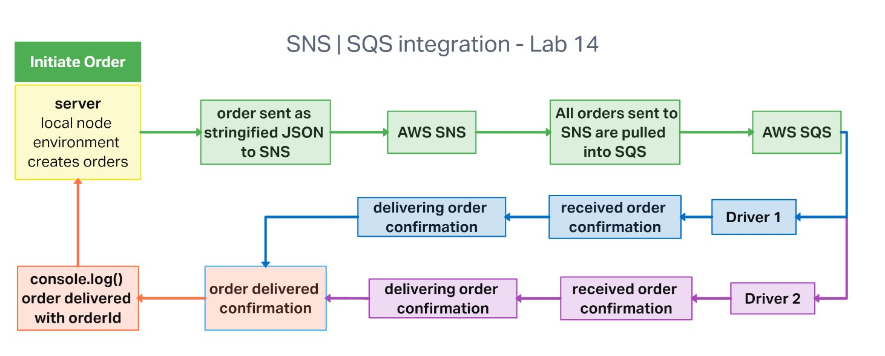
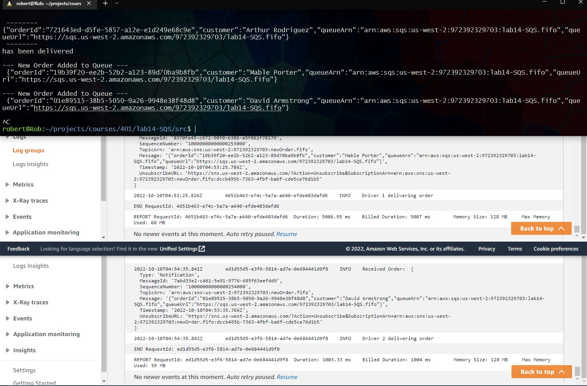

# AWS SNS and SQS integration

## Code 401d48 lab 14

## Author: Robert Ball | Alan Chelko

---

### Problem Domain

* Create a new application using real-time events


---
Requirements

* Your application must employ the following programming concepts:

  * A “hub” server that moderates all events
  * Multiple “clients” that connect to the hub which can both publish and subscribe to events
  * Must operate over a network

---

Documentation:

Application UML



Below is showing the result of running

```
 node server.js
 ```

 inside of the `/src` directory

Explanation of images:

* The terminal is logging the output generated from creating an order and sending it to the specified SNS queue
  * The first log in the terminal (showing that an order has been delivered) is triggered by a successful delivery from either driver 1 or driver 2
* The bottom two windows are showing the SQS CloudWatch logs and are included to highlight that driver 1 and driver 2 log that they have received and order and are delivering that order

;

---
Dependencies

```JSON
  "dependencies": {
    "aws-sdk": "^2.1231.0",
    "chance": "^1.1.8",
    "dotenv": "^16.0.3",
    "sqs-consumer": "^5.7.0",
    "sqs-producer": "^2.1.0"
  }
```

Setup

1. Create an AWS account and create a new SNS topic and SQS application using the AWS console.
2. Clone repo to your local system
3. with the repo open in your editor of choice, run:

```code
npm init -y
install dependencies
```

4. run server.js with Node and open the CloudWatch Logs for your drivers.
